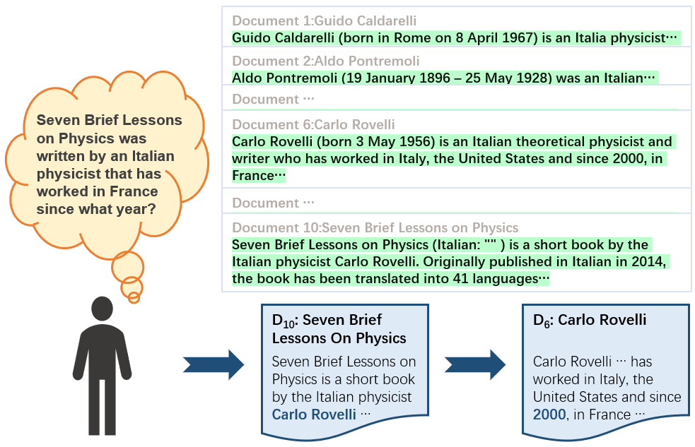
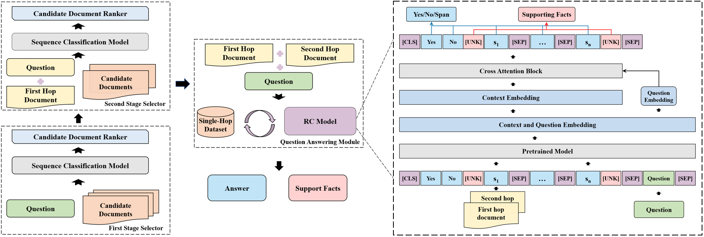

# FE2H ([From Easy to Hard: Two-stage Selector and Reader for Multi-hop Question Answering](https://arxiv.org/abs/2205.11729))

## 排行榜[HotpotQA](https://hotpotqa.github.io/)提交日Jan 28, 2022 SOTA
## 大道至简
两个分类器组成的文档筛选器网络和一个指针阅读器网络预测答案，不需要花里胡哨的GNN。
## 筛选器代码
### 脚本目录selector_script
#### 运行脚本
sh run_all_just_para_large.sh
### 代码目录src
#### 模型目录pretrain_model
## 阅读器代码
### 脚本目录reader_scripts
#### 运行脚本
sh run_qanet_with_mask_1e_pretrain_train_bs12_save_all_step.sh
#### 常用命令及日志目录位置
nohup sh run_qanet_with_mask_1e_pretrain_train_bs12_save_all_step >>../../log/20220125_run_qanet_pretrain_bs12_lr10_with_mask_step.log 2>&1 &
##### 不包含进度信息的日志会在
log_20220125_run_qanet_pretrain_bs12_lr10_with_mask_step*.log文件
### 代码目录reader_src
#### 模型目录pretrain_model
### 提交的两个模型及代码文件Codalab
- [FE2H on ALBERT (single model)](https://worksheets.codalab.org/bundles/0xba64f44df95c4428a5d450acd361b9f6)
- [FE2H on ELECTRA (single model)](https://worksheets.codalab.org/worksheets/0x47d755eef4fa41ddaf841e471697ecbd)
